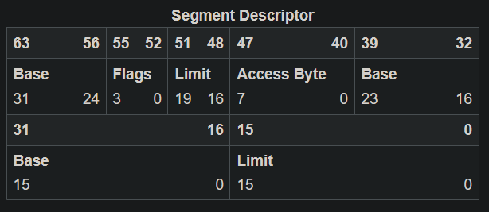
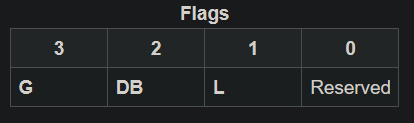
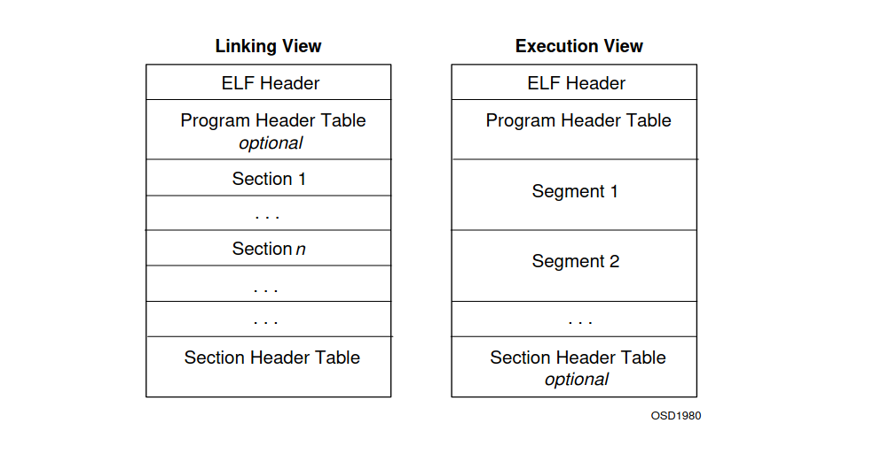
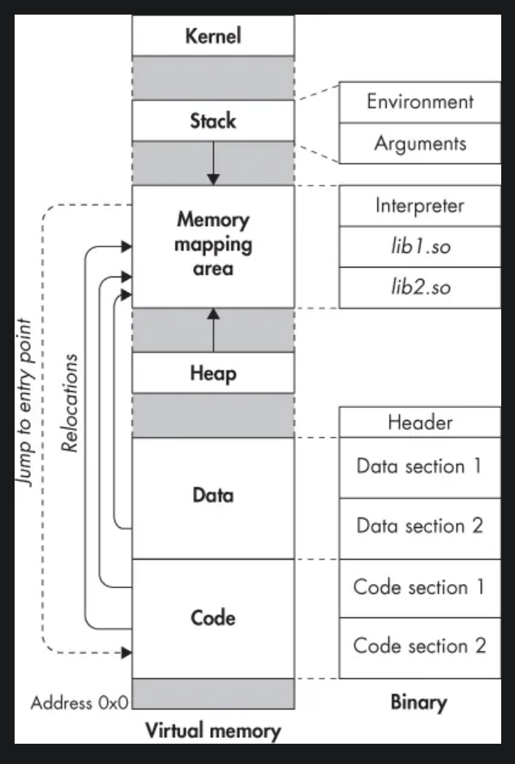

---

# What is an OS?

An OS (Operating System) is a software that allows the user to run programs while managing I/O devices, memory, CPU time, and data.

- **I/O devices**: Respond to human actions.
- **Memory**: Workspace for processes.
- **CPU time**: Handles multitasking, etc.
- **Data**: Manages the file system.

### Structure of an OS Project:
- **User space**
- **Kernel**
- **Drivers**
- **Bootloader**

- **User space** communicates with signals (which are interrupts) to the kernel.
  - **System call / syscall**: These are requests to the kernel for specific tasks. The user has minimal permissions (→ **RINGS**). **The user is an idiot**.

There is an abstraction layer provided by **drivers**. They can be placed inside or outside the kernel.  
**Car analogy**: A car is just a bunch of metal and needs a driver to be useful. Similarly, a mouse needs a driver to be initialized; otherwise, it's just a piece of plastic.

The **bootloader** boots the kernel.

### 3 Kernel Designs:
1. **Monolithic kernel**: One big kernel that contains everything.
2. **Microkernel**: Contains a minimal kernel and works with servers and drivers (which are just programs). The user space communicates with these programs, not directly with the kernel (they have privileges between the kernel and user space).
3. **Hybrid kernel**: For some functionalities, communication goes directly to the kernel, while for others, it goes through drivers and servers.

---

# Booting

### What happens when you press the power button on a computer:
- The **BIOS** (Basic Input/Output System) is launched. It is responsible for booting and basic I/O operations.

The **IBM PC BIOS** became a standard in 1981 and was later renamed to **Legacy BIOS/CSM** (Compatibility Support Mode).  
**UEFI** (Unified Extensible Firmware Interface) appeared in 2006 but became widely used in 2012 with Windows 8.

**Interface**: A device or program enabling a user to communicate with a computer.

### First thing the BIOS does:
- **POST** (Power-On Self-Test): A test to determine if everything is fine with the hardware on the motherboard.
  - If everything is OK → Proceeds to the next step.
  - If not → Displays an error message.

Then, the BIOS checks its **boot priority list** (devices that can store an OS). It can be:
- Hard drive
- USB mass storage
- Network?

If you set USB mass storage as the top priority and plug in a USB stick with your childhood photos, the BIOS will try to boot from it.  
**Spoiler**: It cannot.

For this reason, a mechanism was implemented for the BIOS to determine if the storage contains bootable code. This mechanism depends on whether you are using **Legacy BIOS** or **UEFI BIOS**.

**Sector**: A 512-byte chunk of memory that mass storage devices are split into.  
The first sector of a mass storage device is called the **boot sector**.

---

## Legacy BIOS:
- Loads the boot sector into RAM at the hexadecimal address `0x7C00` and looks for a signature: `01010101 10101010` → `55 AA`.

Why `01010101 10101010`?  
If we have an 8-bit bus, all combinations will be tested, ensuring every bit can be flipped.  
The **0x86 CPU** is mostly little-endian, so the signature will be `0xAA55`.

The BIOS loads the boot sector into RAM, and the last two bytes of the boot sector must be `0x55AA`.  
It is recommended to fill the first 510 bytes with zeros to avoid misinterpretation by the CPU.

An infinite loop (`jmp $`) is added to force the CPU to always have an instruction to execute.  
Why?  
Because if not, the CPU will search the next mass storage device for a boot sector.

**Firmware**: Permanent software programmed into read-only memory.  
**Partition**: A section of the disk with a defined start and end point. It is a way to split the disk into smaller sections.

### **Master Boot Record (MBR):**

| **Offset** | **Size** | **Content** |
|------------|-----------|-------------|
| 0x0000 | 440 bytes | **Bootloader code** (boot program) |
| 0x01B8 | 4 bytes | **Disk signature** (unique ID of the disk) |
| 0x01BC | 2 bytes | **Reserved space** (unused and set to 0) |
| 0x01BE | 64 bytes | **Partition table** (4 entries of 16 bytes) |
| 0x01FE | 2 bytes | **MBR signature (0x55AA)** |

- **Partition table (64 bytes)**: Contains 4 entries of 16 bytes (1 per partition).
  - Each entry describes a partition:
    - Type (FAT32, NTFS, EXT4, etc.)
    - Start and end address
    - Status (Active/Bootable)

**MBR is something you only need if you are going to implement a file system.**

---

## UEFI:
Checks for a valid **GPT** (GUID Partition Table).  
**GUID** means **Globally Unique Identifier**.

```
+---------------------------+  Sector 0
|       Protected MBR       |  (Contains a 0xEE partition covering the entire disk)
+---------------------------+
|     GPT Header (Primary)  |  Sector 1
+---------------------------+
|  GPT Partition Table      |  Sectors 2 to 33 (usually 128 entries)
+---------------------------+
|       ESP (EFI System)    |  EFI System Partition (e.g., /boot/efi)
+---------------------------+
|     Other partitions      |  (OS, data, swap, etc.)
+---------------------------+
|    GPT Header (Backup)    |  (Last sector of the disk)
+---------------------------+
| GPT Partition Table       |  (Backup, just before the last sector)
+---------------------------+
```

---

# Using BIOS Instructions

The bootloader has to prepare the environment for the kernel.

The x86 CPU boots in **16-bit mode** and has three main modes:
- **Real mode** | 16 bits
  - The CPU has access to only 1MB of memory.
  - Uses BIOS interrupts to communicate with hardware.
  - No memory protection or multitasking.
- **Protected mode** | 32 bits
  - Access up to 4GB of RAM.
  - Enables protection like paging and segmentation.
  - The bootloader sets up the GDT and IDT.
- **Long mode** | 64 bits

### What the bootloader has to do:
1. **Load more disk space**:
   - Especially the space where the rest of the bootloader and the kernel are located. The MBR is only 512 bytes, which is too small for a full-fledged bootloader.
2. **Switch to a higher mode**:
   - Switches from 16-bit real mode to 32-bit protected mode or 64-bit long mode to access full CPU features.
3. **Gather vital information**:
   - Collects memory maps, CPU info, filesystem data, and boot parameters for the kernel.

**Interrupts** are signals sent to the CPU through an external bus with a specific code. They tell the CPU to stop its current task and handle the external event. Once the CPU finishes handling the interrupt, it resumes its previous task.

The CPU has a chip (most commonly the **8259 PIC chip**) that functions as the **Interrupt Controller**, managing these interrupts.

**PIC = Programmable Interrupt Controller**

### Example: Keyboard Interrupt
1. **Key Pressed** → Keyboard Controller Sends an Interrupt:
   - When a key is pressed, the keyboard sends a signal to the PIC (IRQ1).
2. **PIC Sends Interrupt to CPU**:
   - The PIC detects IRQ1 and sends an interrupt signal (Interrupt Vector 0x21) to the CPU’s IDT.
3. **CPU Handles the Interrupt via IDT**:
   - The CPU checks its IDT and jumps to the keyboard interrupt handler.
4. **Interrupt Handler Reads the Keyboard Port**:
   - The handler reads the scancode from I/O port 0x60.
5. **Key Processing & Acknowledgment**:
   - The handler processes the scancode and sends an **End of Interrupt (EOI)** signal to the PIC.

---

### System Calls:
- **Syscalls** are handled with interrupts. A specific interrupt code is assigned to each instruction.

In **real mode**, the CPU and BIOS communicate via interrupts, with the BIOS executing 16-bit code to handle hardware events and return data.

**BIOS is our friend.**

The BIOS has access to all CPU registers and can read them later. The BIOS offers different instructions organized in **instruction vectors**, accessed via **interrupt vectors** (IVT).

**Interrupt vectors**: A table of addresses pointing to BIOS routines.

In **protected mode**, the **IDT** replaces the **IVT** and defines handlers for exceptions, IRQs, and software interrupts.

**Instruction vector 0x10** is a BIOS interrupt service, and the values in **AH** (0x00 to 0x13) are different functions for managing text or graphic display.

### Example:
```assembly
mov ah, 0x0E
INT 0x10
```

The BIOS sends 16-bit instruction codes, so in higher bit modes, you cannot ask the BIOS to perform tasks.

---

### Hard Drive Disk (HDD):
A hard drive has multiple plates, with read/write heads between them. The plates rotate, and the heads act as electromagnets, flipping the polarization of regions to write data or detecting polarization to read data.

**Sector**: A 512-byte chunk of memory.  
**CHS** → **Cylinder-Head-Sector**:  
- **Cylinder**: A collection of tracks.
- **Head**: The read/write head.
- **Sector**: A specific section of a track.

In modern drives, **LBA (Logical Block Addressing)** has replaced CHS. Each sector is identified by a unique number (LBA address).

---

### Real Mode Addressing:
In real mode, there are only 16-bit registers, but the addressing bus is 20 bits. The **segment:offset** system is used to address 20 bits of memory.

**ADDR = (16 * Segment) + Offset**

- **DI** usually stores the offset.
- **ES** usually stores the segment but is generally not modified.

The maximum number of sectors is 128, each 512 bytes:  
128 * 512 = 65,536 bytes (64 KB).

---

### BIOS Interrupt 0x13:
This BIOS interrupt reads sectors from a disk into memory.

**Parameters**:
| Register |
|----------|
| `AH` = `0x02` |
| `AL` = Number of sectors to read (1–128) |
| `CH` = Cylinder number (0–1023, bits 0–7) |
| `CL` = Sector number (1–63, bits 0–5) + (Cylinder bits 8–9 in bits 6–7) |
| `DH` = Head number (0–255) |
| `DL` = Drive number (`0x00` = Floppy, `0x80` = First HDD) |
| `ES:BX` = Memory address to store the data |

If loading more than 64 KB, adjust **ES** accordingly.

---

# Global Descriptor Table (GDT) and Protected Mode

In **16-bit real mode**, we use a 20-bit bus, but with the release of 32-bit CPUs, a mechanism was needed to maintain backward compatibility. The solution was the **A20 line**, a gate that could be enabled or disabled to allow or block access to memory above 1 MB.

The CPU uses **FAST A20**:
1. Read from port `0x92` → `IN AL, 0x92`.
2. Flip the A20 bit → `OR AL, 2`.
3. Write to port `0x92` → `OUT 0x92, AL`.

### Logical Gates:

| **Operation** | **IN A** | **IN B** | **OUT** |
|--------------|------------|------------|-----------------|
| **AND**      | 0          | 0          | 0               |
|              | 0          | 1          | 0               |
|              | 1          | 0          | 0               |
|              | 1          | 1          | 1               |
| **OR**       | 0          | 0          | 0               |
|              | 0          | 1          | 1               |
|              | 1          | 0          | 1               |
|              | 1          | 1          | 1               |
| **XOR**      | 0          | 0          | 0               |
|              | 0          | 1          | 1               |
|              | 1          | 0          | 1               |
|              | 1          | 1          | 0               |
| **NOT**      | 0          | -          | 1               |
|              | 1          | -          | 0               |

---

### GDT (Global Descriptor Table):
The GDT is a table containing information about different memory segments, such as their base address, limit, and other attributes. It is essential for **protected mode**.

**GPF** = General Protection Fault.

The GDT can trigger a **GPF**.

### GDT Entries:
1. **NULL Descriptor**: 8 bytes of zeros (64 bits).
2. **Code/Data Descriptor**: Describes segments like base address, limit, etc.
3. **Task State Segment Descriptor (TSS)**: Used for multitasking in user space.
4. **GDTR (GDT Register)**: Points to the GDT.

---

### Task State Segment (TSS):
**TSS IS OPTIONAL**

The **TSS** is a memory structure that stores the state of a task (process or thread) in protected mode. The **TSS Descriptor (TSSD)** is an entry in the GDT that describes the location and size of the TSS.

The **TSS** is used by the CPU to:
- Manage task switching.
- Store the state of a process (registers, ESP, EIP, etc.).
- Define the stack for privilege transitions (Ring 3 → Ring 0).

### TSS in 32-bit Mode:

| **Field**          | **Size** | **Description** |
|--------------------|-----------|----------------|
| **Previous TSS**   | 4 bytes   | Used for linked task switching, otherwise 0. |
| **ESP0**           | 4 bytes   | Stack pointer for Ring 0. |
| **SS0**            | 4 bytes   | Stack segment for Ring 0. |
| **ESP1**           | 4 bytes   | Stack pointer for Ring 1 (rarely used). |
| **SS1**            | 4 bytes   | Stack segment for Ring 1. |
| **ESP2**           | 4 bytes   | Stack pointer for Ring 2. |
| **SS2**            | 4 bytes   | Stack segment for Ring 2. |
| **CR3**            | 4 bytes   | Page Directory Base Register (if paging is active). |
| **EIP**            | 4 bytes   | Instruction pointer. |
| **EFLAGS**         | 4 bytes   | CPU status register. |
| **EAX, ECX, ...**  | 4 bytes each | General-purpose registers. |
| **LDT Selector**   | 4 bytes   | Selector for the Local Descriptor Table (LDT). |
| **Trap Flag**      | 2 bytes   | Triggers an interrupt after task switching (debug). |
| **IO Map Base**    | 2 bytes   | Start of the I/O permission bitmap. |

---

### Segment Descriptor

A **Segment Descriptor** is **8 bytes long** (64 bits) and is divided into multiple fields.

### **Diagram of a Segment Descriptor (64 bits)**  



- **Base Address**: A 32-bit value representing the base address where the segment begins.
- **Limit**: A 20-bit value that indicates the size of the segment. It can either represent the size in byte units or 4 KiB pages, depending on the granularity bit.
- **Access Byte**: Contains several flags related to the segment’s properties like presence, privilege level, and type.
- **Flags**: Includes additional information such as the granularity, segment size, and mode.

### Segment Descriptor Table

| Field             | Size (bits) | Example Value | Description |
|-------------------|-------------|---------------|-------------|
| **Base Address**   | 32          | `0x00000000`  | The linear address where the segment starts |
| **Limit**          | 20          | `0xFFFFF`     | Maximum size of the segment in either byte or 4 KiB pages |
| **Access Byte**    | 8           | `0x9A` (Code) / `0x92` (Data) | Defines the segment's type and its permissions |
| **Flags**          | 4           | `0xC` (G=1, D=1) | Defines the granularity and segment size |

---

### Access Byte Breakdown


The **Access Byte** is divided into several bits that control the properties of the segment. Here’s the breakdown:

| Bit | Name | Description |
|-----|------|-------------|
| **7** | **P (Present)** | Indicates if the segment is valid and in memory (1 = Present, 0 = Absent) |
| **6-5** | **DPL (Descriptor Privilege Level)** | Specifies the privilege level of the segment. 0 = Kernel, 3 = User |
| **4** | **S (Segment Type)** | 1 = Code/Data Segment, 0 = System Segment |
| **3** | **E (Executable)** | 1 = Code Segment, 0 = Data Segment |
| **2** | **DC (Direction/Conforming)** | For Data segments: 0 = grows up, 1 = grows down. For Code segments: Defines privilege level execution |
| **1** | **RW (Read/Write)** | 1 = Readable for Code, Writable for Data |
| **0** | **A (Accessed)** | Set by the CPU when the segment is accessed |

---

### Flags Breakdown



The **Flags** in the Segment Descriptor provide further characteristics of the segment, specifically regarding its granularity, size, and mode.

| Bit | Name | Description |
|-----|------|-------------|
| **3** | **G (Granularity)** | If 1, the Limit is in 4 KiB blocks (page granularity). If 0, the Limit is in 1-byte blocks (byte granularity). |
| **2** | **DB (Descriptor Size)** | If 1, the segment is 32-bit. If 0, the segment is 16-bit. |
| **1** | **L (Long Mode)** | If 1, the segment is for 64-bit code. |
| **0** | **Reserved** | Reserved for future use, typically left as 0 |

---


# IDT - Interrupt Descriptor Table

## Introduction

An **interrupt** is a signal that tells the CPU to stop whatever it's doing, handle that interrupt, and then return to its previous state.

When an interrupt occurs, the CPU executes an **ISR (Interrupt Service Routine)**. We need to configure the CPU to know how it should react to these interrupts and which ISR should handle them.

## IDT Entry Structure

Each entry in the IDT (Interrupt Descriptor Table) consists of the following fields:

- **2 bytes** - Offset Low
- **2 bytes** - GDT Code Selector (usually 8)
- **1 byte**  - IST (Interrupt Stack Table), could be 0
- **1 byte**  - Attributes/Flags:
  - **Present bit (1 bit)**: Indicates if the interrupt is active.
  - **DPL (Desired Privilege Level) (2 bits)**: Specifies the privilege level (Ring 0-3).
  - **Reserved bit (1 bit)**
  - **Type (4 bits)**:
    - **Interrupt Gate** = `1110`
    - **Trap Gate** = `1111`
- **2 bytes** - Offset Mid
- **4 bytes** - Offset High
- **4 bytes** - Reserved/Zero

All **256 entries** correspond to a specific interrupt.

### Attributes Example

If we want to set an attribute, we can use a magic number like:

```
1000 1110 = 0x8E
```

This value represents an **Interrupt Gate** with **DPL 0** and **Present bit set**.

## IDTR - Interrupt Descriptor Table Register

The **IDTR (Interrupt Descriptor Table Register)** stores the size and address of the IDT.

### IDT Size Calculation

```
Size of IDT = 16 bytes * 256 = 4096 - 1 bytes (0xFFF)
```

The IDTR always holds **two values**:
1. **Size of the IDT**
2. **Address of the IDT**

## Loading the IDT

To load the IDT, we use the `LIDT` instruction, providing it with the IDT address. After loading, we must **enable interrupts** using the `STI` instruction.

## Handling an Interrupt

When an interrupt is triggered, we must restore the CPU state after handling it. The CPU state is represented by the **values of all its registers**.

### Steps to Handle an Interrupt:
1. Push all necessary registers onto the stack.
2. Save the stack pointer.
3. Call the C handler.
4. Use registers if needed.
5. Restore the CPU state.

## Interrupt Controllers

### 8259 PIC (Programmable Interrupt Controller)

The **8259 PIC** is a legacy interrupt controller, but it is not widely used today. Modern systems have replaced it with **APIC (Advanced Programmable Interrupt Controller)**.

# APIC (Advanced Programmable Interrupt Controller)

APIC is the modern replacement for the legacy PIC and provides better interrupt management, especially in multi-core processors. 8259A Legacy Mode.

- Master PIC
- Slaver PIC

We communicate to those PIC through the I/O bus (in out)
What are the ports of the Master PIC and Slave PIC ?

```
PIC    | COMMAND | DATA
-----------------------
MASTER |  0x20   | 0x21
SLAVE  |  0xA0   | 0xA1
```

### What Information Should We Send to the PIC?

- **Remapping the PIC**

### Why Is Remapping Necessary?

The IDT has **256 entries**, and the first **16 entries** are reserved for **IRQ(Interrupt Request) channels**. The CPU uses these IRQs for handling hardware requests. By default, the legacy PIC maps IRQ 0-7 to IDT entries **0x08-0x0F** and IRQ 8-15 to **0x70-0x77**. However, the first 32 entries (0x00-0x1F) are **reserved for CPU exceptions**.

To avoid conflicts, we **remap the PIC** so that IRQs start from **IDT entry 0x20 (32)** for IRQ 0-7 and **IDT entry 0x28 (40)** for IRQ 8-15. This ensures that the first 32 IDT entries remain reserved for exceptions.

```
   0 Timer            8 Real Time Clock
   1 Keyboard         9 General I/O
   2 PIC 2           10 General I/O
   3 COM 2           11 General I/O
   4 COM 1           12 General I/O
   5 LPT 2           13 Coprocessor
   6 Floppy disk     14 IDE Bus
   7 LPT 1           15 IDE Bus
```

The first thing we want to do is to send reinitialize code to both master and slave PIC. 
Then we want to input some new data for remapping the PIC.
We have to specify which IRQs  will be handled by which programmable interrupt controller.
**One programmable interrupt controller can handle 8 IRQs at the time**

The most standard way to manage this is to let the Master PIC have everything from 0 to 7 and the Slaver PIC have from 8 to 15.

To the master we have to send the IRQ because one of the IRQs of the master has to be reserved by a slave that's why it's called the slave.

### **Connection Between the Master PIC and the Slave PIC**  

The **8259 PIC (Programmable Interrupt Controller)** architecture uses **two PIC controllers** to manage up to **16 IRQs**:  
- **The Master PIC** (handles IRQs 0 to 7)  
- **The Slave PIC** (handles IRQs 8 to 15)  

However, the **CPU can only communicate with the Master PIC**. So, for the CPU to receive interrupts from the **Slave PIC**, they must be routed **through the Master PIC**.  

### **Why Is One IRQ of the Master Reserved for the Slave?**  

The **Master PIC** and the **Slave PIC** must be connected to work together. This connection is established through **IRQ2 of the Master PIC**.  

- **IRQ2 of the Master PIC** is reserved to receive interrupts from the **Slave PIC**.  
- When a device connected to the **Slave PIC** triggers an interrupt (e.g., a mouse on **IRQ12**), the **Slave PIC** sends this interrupt through **IRQ2 of the Master PIC**.  
- The **Master PIC** then notifies the CPU that **IRQ2** has been activated, and the CPU looks up the corresponding **Interrupt Service Routine (ISR)** in the IDT.   

To avoid conflicts, we **remap the PIC IRQs** starting from **interrupt 32 (0x20 in hexadecimal)**.  

After remapping:  
- **IRQ 0 - 7 (Master PIC) → Interrupts 32 - 39**  
- **IRQ 8 - 15 (Slave PIC) → Interrupts 40 - 47**  

This means that:  
- **IRQ2 of the Master PIC** corresponds to **interrupt 34 (0x22)** and is still used to receive interrupts from the **Slave PIC**.  

- Important things : 

Why send 4 instead of 2 to the Master PIC (IRQ2 is number 2 not 4).


   - In binary, **IRQ2** is represented as `00000010` (`0x2`).  
   - However, when configuring the Master PIC with **ICW3 (Initialization Command Word 3)**, we don’t provide the IRQ number directly.  
   - Instead, we use a **bitmask** to indicate **which IRQ line is reserved for the Slave PIC**.  
   - **Each bit in the value corresponds to an IRQ line**:
     - Bit `0` → IRQ0  
     - Bit `1` → IRQ1  
     - Bit `2` → IRQ2  
     - Bit `3` → IRQ3  
     - etc.  

   - Since the Slave is connected to **IRQ2**, we **set bit 2 to `1`**, which results in `00000100` (`0x4`).  

### **Why Does the Slave Receive `2` Instead of `4`?**  
For the **Slave PIC**, ICW3 is used to define **its identification in the cascade setup**.  
- Since the Slave is **connected through IRQ2** of the Master, it identifies itself with **ID `2`**.  
- That’s why we send **`2` (`0x2`)** directly to the Slave instead of using a bitmask.  

- To the **Master PIC**, we send `4` (`0b00000100`) → **Bitmask** indicating that the Slave is connected via **IRQ2**.  
- To the **Slave PIC**, we send `2` (`0x2`) → **Its cascade identification number**.  


```
Send to both Master and Slave command 0x11 to reinit their values.
Then send data 0 to the Master and 8 for the Slave (Means they will handle respectively from 0-7 and 8-15).
Then send data 4 and 2 (bitmask and cascade)
Then send data 1 and 1 (8086 CPU mode)
Last we want to mask all the interruptions and only unmask the IRQ that we actually need.
If we want to mask all the IRQs we just simply send data 0xFF to both Master and Slave port.

         Master         |      Slave
Bits : 1 1 1 1 1 1 1 1  | 1 1  1  1  1  1  1  1
IRQs : 0 1 2 3 4 5 6 7  | 8 9 10 11 12 13 14 15

Finally we send an End of Interrupt (EOI) signal, we write the 0x20 command to the 0x20 command port of the Master PIC.
```

---

# LD SCRIT FILE

- The linker combines input files into a single output file.The output file and each input file are in a special data format known as an object file format. The output file is often called an executable, but for our purposes we will also call it an object file. Each object file has, among other things, a list of sections. We sometimes refer to a section in an input file as an input section; similarly, a section in the output file is an output section. Each section in an object file has a name and a size. Most sections also have an associated block of data, known as the section contents. A section may be marked as loadable, which means that the contents should be loaded into memory when the output file is run. A section with no contents may be allocatable, which means that an area in memory should be set aside, but nothing in particular should be loaded there (in some cases this memory must be zeroed out). A section which is neither loadable nor allocatable typically contains some sort of debugging information. Every loadable or allocatable output section has two addresses. The first is the VMA, or virtual memory address. This is the address the section will have when the output file is run. The second is the LMA, or load memory address. This is the address at which the section will be loaded. In most cases the two addresses will be the same.

- You can see the sections in an object file by using the objdump program with the ‘-h’ option. 

- Every object file also has a list of symbols, known as the symbol table. A symbol may be defined or undefined. Each symbol has a name, and each defined symbol has an address, among other information. If you compile a C or C++ program into an object file, you will get a defined symbol for every defined function and global or static variable. Every undefined function or global variable which is referenced in the input file will become an undefined symbol. 

- You can see the symbols in an object file by using the nm program, or by using the objdump program with the ‘-t’ option. 

- VMA =  virtual memory address.
- LDA = load memory address.

- The simplest possible linker script has just one command: ‘SECTIONS’. You use the ‘SECTIONS’ command to describe the memory layout of the output file. 

```nasm
SECTIONS
{
  . = 0x10000;
  .text : { *(.text) }
  . = 0x8000000;
  .data : { *(.data) }
  .bss : { *(.bss) }
}
```

- The first line inside the ‘SECTIONS’ command of the above example sets the value of the special symbol ‘.’, which is the location counter. If you do not specify the address of an output section in some other way, the address is set from the current value of the location counter. The location counter is then incremented by the size of the output section. At the start of the ‘SECTIONS’ command, the location counter has the value ‘0’. 

- The second line defines an output section, ‘.text’. Within the curly braces after the output section name, you list the names of the input sections which should be placed into this output section. The ‘*’ is a wildcard which matches any file name. The expression ‘*(.text)’ means all ‘.text’ input sections in all input files.
- Since the location counter is ‘0x10000’ when the output section ‘.text’ is defined, the linker will set the address of the ‘.text’ section in the output file to be ‘0x10000’.
- The remaining lines define the ‘.data’ and ‘.bss’ sections in the output file. The linker will place the ‘.data’ output section at address ‘0x8000000’. After the linker places the ‘.data’ output section, the value of the location counter will be ‘0x8000000’ plus the size of the ‘.data’ output section. The effect is that the linker will place the ‘.bss’ output section immediately after the ‘.data’ output section in memory. 

```nasm
chabrune@k2r1p4:Desktop/kfs ‹main*›$ objdump -ht build/kfs

build/kfs:     file format elf32-i386

Sections:
Idx Name          Size      VMA       LMA       File off  Algn
  0 .text         00000a66  00200000  00200000  00001000  2**12
                  CONTENTS, ALLOC, LOAD, READONLY, CODE
  1 .text.__x86.get_pc_thunk.bx 00000004  00200a66  00200a66  00001a66  2**0
                  CONTENTS, ALLOC, LOAD, READONLY, CODE
  2 .text.__x86.get_pc_thunk.ax 00000004  00200a6a  00200a6a  00001a6a  2**0
                  CONTENTS, ALLOC, LOAD, READONLY, CODE
  3 .text.__x86.get_pc_thunk.si 00000004  00200a6e  00200a6e  00001a6e  2**0
                  CONTENTS, ALLOC, LOAD, READONLY, CODE
  4 .text.__x86.get_pc_thunk.di 00000004  00200a72  00200a72  00001a72  2**0
                  CONTENTS, ALLOC, LOAD, READONLY, CODE
  5 .rodata       00000080  00201000  00201000  00002000  2**12
                  CONTENTS, ALLOC, LOAD, READONLY, DATA
  6 .eh_frame     00000548  00201080  00201080  00002080  2**2
                  CONTENTS, ALLOC, LOAD, READONLY, DATA
  7 .rodata.str1.1 0000001c  002015c8  002015c8  000025c8  2**0
                  CONTENTS, ALLOC, LOAD, READONLY, DATA
  8 .data         00000008  00202000  00202000  00003000  2**12
                  CONTENTS, ALLOC, LOAD, DATA
  9 .got.plt      0000000c  00202008  00202008  00003008  2**2
                  CONTENTS, ALLOC, LOAD, DATA
 10 .bss          000008c0  00203000  00203000  00003014  2**12
                  ALLOC
 11 .stack        00001000  002038c0  002038c0  00003014  2**0
                  ALLOC
 12 .debug_info   0000144f  00000000  00000000  00003014  2**0
                  CONTENTS, READONLY, DEBUGGING, OCTETS
 13 .debug_abbrev 00000b40  00000000  00000000  00004463  2**0
                  CONTENTS, READONLY, DEBUGGING, OCTETS
 14 .debug_loc    00000aa6  00000000  00000000  00004fa3  2**0
                  CONTENTS, READONLY, DEBUGGING, OCTETS
 15 .debug_aranges 00000180  00000000  00000000  00005a49  2**0
                  CONTENTS, READONLY, DEBUGGING, OCTETS
 16 .debug_ranges 00000198  00000000  00000000  00005bc9  2**0
                  CONTENTS, READONLY, DEBUGGING, OCTETS
 17 .debug_line   00000c8a  00000000  00000000  00005d61  2**0
                  CONTENTS, READONLY, DEBUGGING, OCTETS
 18 .debug_str    000005b6  00000000  00000000  000069eb  2**0
                  CONTENTS, READONLY, DEBUGGING, OCTETS
 19 .comment      0000002b  00000000  00000000  00006fa1  2**0

SYMBOL TABLE:
00000000 l    df *ABS*  00000000 src/boot.s
00000000 l    df *ABS*  00000000 gdt.c
00000000 l    df *ABS*  00000000 idt.c
00201000 l     O .rodata        00000080 scancode_to_char.0
00000000 l    df *ABS*  00000000 kernel.c
00000000 l    df *ABS*  00000000 vga.c
00000000 l    df *ABS*  00000000 ft_itoa.c
00203888 l     O .bss   0000000c buffer.0
00000000 l    df *ABS*  00000000 ft_memcpy.c
00000000 l    df *ABS*  00000000 ft_memset.c
00000000 l    df *ABS*  00000000 ft_printk.c
002038a0 l     O .bss   00000020 buffer.0
00000000 l    df *ABS*  00000000 ft_strcat.c
00000000 l    df *ABS*  00000000 ft_strcmp.c
00000000 l    df *ABS*  00000000 ft_strcpy.c
00000000 l    df *ABS*  00000000 ft_strlen.c
00000000 l    df *ABS*  00000000 src/gidt.s
00000000 l    df *ABS*  00000000 src/inb.s
00000000 l    df *ABS*  00000000 src/keyboard.s
00000000 l    df *ABS*  00000000 src/lidt.s
00000000 l    df *ABS*  00000000 src/outb.s
00000000 l    df *ABS*  00000000 src/reloadSegments.s
00200a57 l       .text  00000000 reload_CS
00000000 l    df *ABS*  00000000 
00202008 l     O .got.plt       00000000 _GLOBAL_OFFSET_TABLE_
00200a10 g       .text  00000000 inb
00200a6e g     F .text.__x86.get_pc_thunk.si    00000000 .hidden __x86.get_pc_thunk.si
00203884 g     O .bss   00000004 xpos
00200a72 g     F .text.__x86.get_pc_thunk.di    00000000 .hidden __x86.get_pc_thunk.di
00200980 g     F .text  00000039 ft_strcpy
00203060 g     O .bss   00000006 g_IDTR
00200540 g     F .text  00000034 puts
00200940 g     F .text  00000038 ft_strcmp
00200a6a g     F .text.__x86.get_pc_thunk.ax    00000000 .hidden __x86.get_pc_thunk.ax
00200a50 g       .text  00000000 reloadSegments
00200220 g     F .text  0000004e keyboard_handler
002003e0 g     F .text  00000063 set_cursor
00203020 g     O .bss   00000040 g_GDT
00200450 g     F .text  0000007c enable_cursor
00203080 g     O .bss   00000800 g_IDT
00200690 g     F .text  00000035 ft_memcpy
00200a30 g       .text  00000000 load_IDT
002009f0 g       .text  00000000 _start
002000d0 g     F .text  0000003e set_GDT_Gate
002001b0 g     F .text  00000067 init_idt
00200a66 g     F .text.__x86.get_pc_thunk.bx    00000000 .hidden __x86.get_pc_thunk.bx
00200580 g     F .text  0000003c ft_lenght
00200010 g     F .text  000000c0 init_gdt
002048c0 g       .stack 00000000 stack_top
002004d0 g     F .text  00000061 init
00200a40 g       .text  00000000 outb
002005c0 g     F .text  000000c4 ft_itoa
002002f0 g     F .text  000000eb putc
00200a20 g       .text  00000000 keyboard_ISR
00200110 g     F .text  00000095 remap_pic
00203880 g     O .bss   00000004 ypos
00200780 g     F .text  00000162 ft_printk
00202000 g     O .data  00000001 text_color
00200700 g     F .text  0000007a ft_itoa_base
00202004 g     O .data  00000004 video
00200270 g     F .text  0000003c setGate
002008f0 g     F .text  00000048 ft_strcat
00203000 g     O .bss   00000006 g_GDTR
002009c0 g     F .text  00000021 ft_strlen
002002b0 g     F .text  00000038 kmain
00200a00 g       .text  00000000 load_GDT
002006d0 g     F .text  0000002e ft_memset
```

| Section   | Description |
|-----------|------------|
| `.text`   | Program code (CPU instructions) |
| `.rodata` | Constant data (read-only) |
| `.data`   | Initialized global variables |
| `.bss`    | Uninitialized global variables |
| `.stack`  | kernel stack |


### **Where is the Bootloader Loaded into Memory?**  

The **bootloader (GRUB)** is typically loaded **by the BIOS**. Here’s how it works in memory:

---

### **1. Initial Bootloader Loading**
- When a PC boots in **BIOS mode**, the **MBR (Master Boot Record)** is loaded at **0x7C00** by the BIOS.
- The **bootloader (e.g., GRUB)** then takes control and loads its own files.

---

### **2. Where Does GRUB Load the Kernel?**
- GRUB loads the kernel at the address defined in your **linker script**.
- In your case, the kernel will be loaded at **0x200000 (2 MiB).**

---

### **Memory Layout During Boot**
| Memory Address       | Content |
|----------------------|---------|
| **0x00000000 - 0x000003FF** | IVT (Interrupt Vector Table) |
| **0x00000400 - 0x000004FF** | BDA (BIOS Data Area) |
| **0x00000500 - 0x00007BFF** | Free area for BIOS and miscellaneous data |
| **0x00007C00** | **MBR (Primary bootloader, 512 bytes)** |
| **0x00007E00 - 0x0009FFFF** | Secondary bootloader (GRUB) |
| **0x000A0000 - 0x000FFFFF** | Video memory and BIOS extensions |
| **0x00100000 - 0x001FFFFF** | Free space (often used by GRUB) |
| **0x00200000 (2 MiB)** | **Kernel loaded here (defined in the LD script)** |
| **0x00300000 and beyond** | Other memory segments (stack, heap, etc.) |

---

- **After loading the kernel, GRUB transfers control to `_start`.**


---

# Loading the Kernel

The first thing an operating system does is launch its bootloader. The goal of the bootloader is essentially to load the kernel and prepare an environment for the kernel to function properly.

## Boot Process Overview

```
| BOOTLOADER |  --->  | KERNEL |
```

### How the Bootloader Loads the Kernel

Before understanding how the bootloader loads the kernel, it's important to understand how executables are made and what they are.

#### Compilation and Linking Process

At a fundamental level, source code files (`.c`) are just plain text. These files must go through multiple stages to become an executable kernel:

1. **Compilation**: The compiler translates `.c` source code into assembly (`.asm`). This is a human-readable representation of machine instructions.
2. **Assembly**: The assembler converts `.asm` files into machine code, producing object files (`.o`). These contain binary code but are not yet standalone executables.
3. **Linking**: The linker takes multiple object files (`.o`) and combines them into a single executable file in the ELF (Executable and Linkable Format) format.

```
*.c  -->  COMPILER  -->  *.asm  -->  ASSEMBLER  -->  *.o  -->  LINKER  -->  .elf
```

A **flat binary** is a simple file format that contains raw binary data with no additional structure, used in low-level environments like operating systems or firmware. It doesn’t have sections, segments, or metadata.

An **ELF (Executable and Linkable Format)** is a more sophisticated file format used in modern systems, especially in Linux. It contains sections (code, data, etc.), segments, and metadata, allowing for better memory management, debugging, dynamic linking, and compatibility across platforms.

Linux use ELF
Mac use Mach-O
Windows use COM / PE / EXE 

---

## ELF

There are three main types of object files :

• A relocatable file holds code and data suitable for linking with other object files to create an
executable or a shared object file.
• An executable file holds a program suitable for execution.
• A shared object file holds code and data suitable for linking in two contexts. First, the link
editor may process it with other relocatable and shared object files to create another object file.
Second, the dynamic linker combines it with an executable file and other shared objects to
create a process image.


An ELF (Executable and Linkable Format) file is organized into several sections, each serving a specific purpose. Here is a schematic representation of its structure:

Before diving into memory layout, it's essential to understand the basic structure of an ELF file. An ELF file consists of several parts:

   - ELF Header: Contains information about the file type, architecture, and other global properties.

   - Program Headers: Describe the segments to be loaded into memory.

   - Section Headers: Provide details about the sections used by the linker and debugger.

   - Segments and Sections: The actual data that makes up the executable or library.







## ELF file on disk

```
+-------------------------------+
|          ELF Header           |  <-- Entry Point: 0x2009f0
|           (52 octets)         |
+-------------------------------+
| Program Header Table (4 PHDR) |  <-- LOAD (Code), LOAD (RO), LOAD (RW), GNU_STACK
+-------------------------------+
|           .text               |  ╔═══════════════╗
|       (0xA66 octets)          |  ║ Code Machine  ║
|  .text.__x86.get_pc_thunk.*   |  ║ (ex: mov, jmp)║
+-------------------------------+  ╚═══════════════╝
|           .rodata             |  ╔═══════════════╗
|       (0x80 octets)           |  ║ Constantes    ║
|    .eh_frame, .rodata.str1.1  |  ║ (ex: "Hello") ║
+-------------------------------+  ╚═══════════════╝
|           .data               |  ╔═══════════════╗
|        (8 octets)             |  ║ Variables     ║
|       .got.plt (12 octets)     |  ║ Initialisées  ║
+-------------------------------+  ╚═══════════════╝
|           .bss                |  [Espace réservé]
|      (0x8C0 octets)           |  (Non stocké)
|           .stack              |  
|     (0x1000 octets)           |  
+-------------------------------+
|       Section Headers         |
+-------------------------------+
```

---

### Program vs Process

- **Program**: A passive entity stored on disk (ELF file).
- **Process**: An active entity in memory during execution.

---

### Process Memory Layout

When an ELF program is loaded into memory to become a process, it is mapped into the process's virtual address space.

```
+-------------------------------+  Haut de la mémoire
|           .stack              |  ╔═══════════════╗ 0x2038C0
|       (0x1000 octets)         |  ║    Pile       ║
|                               |  ╠═══════════════╣
|           .bss                |  ║    BSS        ║ 0x203000
|       (0x8C0 octets)          |  ║ (Zéro)        ║
+-------------------------------+  ╠═══════════════╣
|           .data               |  ║   Data        ║ 0x202000
|       (8 octets + 12)         |  ║ Initialisées  ║
+-------------------------------+  ╠═══════════════╣
|           .rodata             |  ║  Constantes   ║ 0x201000
|  .eh_frame, .rodata.str1.1    |  ║ (Read-Only)   ║
+-------------------------------+  ╠═══════════════╣
|           .text               |  ║   Code        ║ 0x200000
|  .text.__x86.get_pc_thunk.*   |  ║ Exécutable    ║
|       Entry Point: 0x2009f0 → ───╚═══════════════╝
+-------------------------------+  Bas de la mémoire
```

```
         Fichier ELF                    Mémoire
          +---------+                  +-----------------+
          | .text   | -- LOAD R-E -->  | 0x200000 (Code) |
          +---------+                  +-----------------+
          | .rodata | -- LOAD R ---->  | 0x201000 (RO)   |
          +---------+                  +-----------------+
          | .data   | -- LOAD RW -->   | 0x202000 (RW)   |
          | .bss    |                  | 0x203000 (BSS)  |
          | .stack  |                  | 0x2038C0 (Stack)|
          +---------+                  +-----------------+
```

---


`readelf -e build/kfs`

```
ELF Header:
  Magic:   7f 45 4c 46 01 01 01 00 00 00 00 00 00 00 00 00 
  Class:                             ELF32
  Data:                              2's complement, little endian
  Version:                           1 (current)
  OS/ABI:                            UNIX - System V
  ABI Version:                       0
  Type:                              EXEC (Executable file)
  Machine:                           Intel 80386
  Version:                           0x1
  Entry point address:               0x2009f0
  Start of program headers:          52 (bytes into file)
  Start of section headers:          30712 (bytes into file)
  Flags:                             0x0
  Size of this header:               52 (bytes)
  Size of program headers:           32 (bytes)
  Number of program headers:         4
  Size of section headers:           40 (bytes)
  Number of section headers:         24
  Section header string table index: 23
```

```
Elf file type is EXEC (Executable file)
Entry point 0x2009f0
There are 4 program headers, starting at offset 52

Program Headers:
  Type           Offset   VirtAddr   PhysAddr   FileSiz MemSiz  Flg Align
  LOAD           0x001000 0x00200000 0x00200000 0x00a76 0x00a76 R E 0x1000
  LOAD           0x002000 0x00201000 0x00201000 0x005e4 0x005e4 R   0x1000
  LOAD           0x003000 0x00202000 0x00202000 0x00014 0x028c0 RW  0x1000
  GNU_STACK      0x000000 0x00000000 0x00000000 0x00000 0x00000 RWE 0x10

 Section to Segment mapping:
  Segment Sections...
   00     .text .text.__x86.get_pc_thunk.bx .text.__x86.get_pc_thunk.ax .text.__x86.get_pc_thunk.si .text.__x86.get_pc_thunk.di 
   01     .rodata .eh_frame .rodata.str1.1 
   02     .data .got.plt .bss .stack 
   03   
```

```
There are 24 section headers, starting at offset 0x77f8:

Section Headers:
  [Nr] Name              Type            Addr     Off    Size   ES Flg Lk Inf Al
  [ 0]                   NULL            00000000 000000 000000 00      0   0  0
  [ 1] .text             PROGBITS        00200000 001000 000a66 00  AX  0   0 4096
  [ 2] .text.__x86.[...] PROGBITS        00200a66 001a66 000004 00  AX  0   0  1
  [ 3] .text.__x86.[...] PROGBITS        00200a6a 001a6a 000004 00  AX  0   0  1
  [ 4] .text.__x86.[...] PROGBITS        00200a6e 001a6e 000004 00  AX  0   0  1
  [ 5] .text.__x86.[...] PROGBITS        00200a72 001a72 000004 00  AX  0   0  1
  [ 6] .rodata           PROGBITS        00201000 002000 000080 00   A  0   0 4096
  [ 7] .eh_frame         PROGBITS        00201080 002080 000548 00   A  0   0  4
  [ 8] .rodata.str1.1    PROGBITS        002015c8 0025c8 00001c 01 AMS  0   0  1
  [ 9] .data             PROGBITS        00202000 003000 000008 00  WA  0   0 4096
  [10] .got.plt          PROGBITS        00202008 003008 00000c 04  WA  0   0  4
  [11] .bss              NOBITS          00203000 003014 0008c0 00  WA  0   0 4096
  [12] .stack            NOBITS          002038c0 003014 001000 00  WA  0   0  1
  [13] .debug_info       PROGBITS        00000000 003014 00144f 00      0   0  1
  [14] .debug_abbrev     PROGBITS        00000000 004463 000b40 00      0   0  1
  [15] .debug_loc        PROGBITS        00000000 004fa3 000aa6 00      0   0  1
  [16] .debug_aranges    PROGBITS        00000000 005a49 000180 00      0   0  1
  [17] .debug_ranges     PROGBITS        00000000 005bc9 000198 00      0   0  1
  [18] .debug_line       PROGBITS        00000000 005d61 000c8a 00      0   0  1
  [19] .debug_str        PROGBITS        00000000 0069eb 0005b6 01  MS  0   0  1
  [20] .comment          PROGBITS        00000000 006fa1 00002b 01  MS  0   0  1
  [21] .symtab           SYMTAB          00000000 006fcc 000440 10     22  26  4
  [22] .strtab           STRTAB          00000000 00740c 0002ba 00      0   0  1
  [23] .shstrtab         STRTAB          00000000 0076c6 00012f 00      0   0  1
Key to Flags:
  W (write), A (alloc), X (execute), M (merge), S (strings), I (info),
  L (link order), O (extra OS processing required), G (group), T (TLS),
  C (compressed), x (unknown), o (OS specific), E (exclude),
  D (mbind), p (processor specific)
```

```

Symbol table '.symtab' contains 68 entries:
   Num:    Value  Size Type    Bind   Vis      Ndx Name
     0: 00000000     0 NOTYPE  LOCAL  DEFAULT  UND 
     1: 00000000     0 FILE    LOCAL  DEFAULT  ABS src/boot.s
     2: 00000000     0 FILE    LOCAL  DEFAULT  ABS gdt.c
     3: 00000000     0 FILE    LOCAL  DEFAULT  ABS idt.c
     4: 00201000   128 OBJECT  LOCAL  DEFAULT    6 scancode_to_char.0
     5: 00000000     0 FILE    LOCAL  DEFAULT  ABS kernel.c
     6: 00000000     0 FILE    LOCAL  DEFAULT  ABS vga.c
     7: 00000000     0 FILE    LOCAL  DEFAULT  ABS ft_itoa.c
     8: 00203888    12 OBJECT  LOCAL  DEFAULT   11 buffer.0
     9: 00000000     0 FILE    LOCAL  DEFAULT  ABS ft_memcpy.c
    10: 00000000     0 FILE    LOCAL  DEFAULT  ABS ft_memset.c
    11: 00000000     0 FILE    LOCAL  DEFAULT  ABS ft_printk.c
    12: 002038a0    32 OBJECT  LOCAL  DEFAULT   11 buffer.0
    13: 00000000     0 FILE    LOCAL  DEFAULT  ABS ft_strcat.c
    14: 00000000     0 FILE    LOCAL  DEFAULT  ABS ft_strcmp.c
    15: 00000000     0 FILE    LOCAL  DEFAULT  ABS ft_strcpy.c
    16: 00000000     0 FILE    LOCAL  DEFAULT  ABS ft_strlen.c
    17: 00000000     0 FILE    LOCAL  DEFAULT  ABS src/gidt.s
    18: 00000000     0 FILE    LOCAL  DEFAULT  ABS src/inb.s
    19: 00000000     0 FILE    LOCAL  DEFAULT  ABS src/keyboard.s
    20: 00000000     0 FILE    LOCAL  DEFAULT  ABS src/lidt.s
    21: 00000000     0 FILE    LOCAL  DEFAULT  ABS src/outb.s
    22: 00000000     0 FILE    LOCAL  DEFAULT  ABS src/reloadSegments.s
    23: 00200a57     0 NOTYPE  LOCAL  DEFAULT    1 reload_CS
    24: 00000000     0 FILE    LOCAL  DEFAULT  ABS 
    25: 00202008     0 OBJECT  LOCAL  DEFAULT   10 _GLOBAL_OFFSET_TABLE_
    26: 00200a10     0 NOTYPE  GLOBAL DEFAULT    1 inb
    27: 00200a6e     0 FUNC    GLOBAL HIDDEN     4 __x86.get_pc_thunk.si
    28: 00203884     4 OBJECT  GLOBAL DEFAULT   11 xpos
    29: 00200a72     0 FUNC    GLOBAL HIDDEN     5 __x86.get_pc_thunk.di
    30: 00200980    57 FUNC    GLOBAL DEFAULT    1 ft_strcpy
    31: 00203060     6 OBJECT  GLOBAL DEFAULT   11 g_IDTR
    32: 00200540    52 FUNC    GLOBAL DEFAULT    1 puts
    33: 00200940    56 FUNC    GLOBAL DEFAULT    1 ft_strcmp
    34: 00200a6a     0 FUNC    GLOBAL HIDDEN     3 __x86.get_pc_thunk.ax
    35: 00200a50     0 NOTYPE  GLOBAL DEFAULT    1 reloadSegments
    36: 00200220    78 FUNC    GLOBAL DEFAULT    1 keyboard_handler
    37: 002003e0    99 FUNC    GLOBAL DEFAULT    1 set_cursor
    38: 00203020    64 OBJECT  GLOBAL DEFAULT   11 g_GDT
    39: 00200450   124 FUNC    GLOBAL DEFAULT    1 enable_cursor
    40: 00203080  2048 OBJECT  GLOBAL DEFAULT   11 g_IDT
    41: 00200690    53 FUNC    GLOBAL DEFAULT    1 ft_memcpy
    42: 00200a30     0 NOTYPE  GLOBAL DEFAULT    1 load_IDT
    43: 002009f0     0 NOTYPE  GLOBAL DEFAULT    1 _start
    44: 002000d0    62 FUNC    GLOBAL DEFAULT    1 set_GDT_Gate
    45: 002001b0   103 FUNC    GLOBAL DEFAULT    1 init_idt
    46: 00200a66     0 FUNC    GLOBAL HIDDEN     2 __x86.get_pc_thunk.bx
    47: 00200580    60 FUNC    GLOBAL DEFAULT    1 ft_lenght
    48: 00200010   192 FUNC    GLOBAL DEFAULT    1 init_gdt
    49: 002048c0     0 NOTYPE  GLOBAL DEFAULT   12 stack_top
    50: 002004d0    97 FUNC    GLOBAL DEFAULT    1 init
    51: 00200a40     0 NOTYPE  GLOBAL DEFAULT    1 outb
    52: 002005c0   196 FUNC    GLOBAL DEFAULT    1 ft_itoa
    53: 002002f0   235 FUNC    GLOBAL DEFAULT    1 putc
    54: 00200a20     0 NOTYPE  GLOBAL DEFAULT    1 keyboard_ISR
    55: 00200110   149 FUNC    GLOBAL DEFAULT    1 remap_pic
    56: 00203880     4 OBJECT  GLOBAL DEFAULT   11 ypos
    57: 00200780   354 FUNC    GLOBAL DEFAULT    1 ft_printk
    58: 00202000     1 OBJECT  GLOBAL DEFAULT    9 text_color
    59: 00200700   122 FUNC    GLOBAL DEFAULT    1 ft_itoa_base
    60: 00202004     4 OBJECT  GLOBAL DEFAULT    9 video
    61: 00200270    60 FUNC    GLOBAL DEFAULT    1 setGate
    62: 002008f0    72 FUNC    GLOBAL DEFAULT    1 ft_strcat
    63: 00203000     6 OBJECT  GLOBAL DEFAULT   11 g_GDTR
    64: 002009c0    33 FUNC    GLOBAL DEFAULT    1 ft_strlen
    65: 002002b0    56 FUNC    GLOBAL DEFAULT    1 kmain
    66: 00200a00     0 NOTYPE  GLOBAL DEFAULT    1 load_GDT
    67: 002006d0    46 FUNC    GLOBAL DEFAULT    1 ft_memset

STT_NOTYPE The symbol's type is not specified
STT_OBJECT The symbol is associated with a data object, such as a variable, an array,
and so on.
STT_FUNC The symbol is associated with a function or other executable code.
STT_FILE A file symbol has STB_LOCAL binding, its section index is SHN_ABS, and
it precedes the other STB_LOCAL symbols for the file, if it is present.
```


